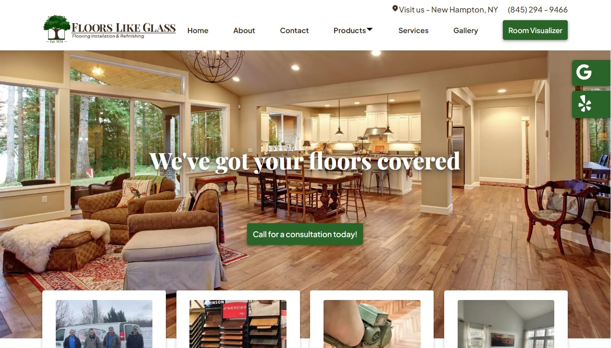

#Floors Like Glass

A Flooring Contractor Site built for client based in New Hampton, NY
Features include:  
* Refined user experience through customer oriented design
* Created reusable React components to keep updates simple and effortless
* Delivers a speedy & reliable website using React, React Router, HTML & CSS
* Optimized load speeds & SEO with PageSpeed Insights
* Responsive & Accessible Design
* Designed each page in Figma
* Custom Logo designed by me!

## Hosted on Netlify - <a href="https://floorslikeglass.com/">Floors Like Glass</a>

<a href="https://floorslikeglass.com/">Floors Like Glass</a>

Floors Like Glass is a website designed and built for my client based out of New Hampton, NY

## Tech Used
* React
* JavaScript
* HTML & CSS
* React Router
* NPM Packages
* Responsive Design
* Accessibility

## About Me
Thank you for checking out my work, I hope you enjoyed my site!  
I'm currently searching for a new career opportunity in Web Development and would love to hear from you, so feel free to reach out.  
These are my socials:  
<a href="mailto:Wabby.404@gmail.com">Wabby.404@gmail.com</a>  
<a href="https://wabby404.github.io/portfolio-redo/">Portfolio Site</a>  
<a href="https://github.com/WAbby404">Github</a>  
<a href="https://www.linkedin.com/in/abbywaddell4042/">Linkedin</a>  
